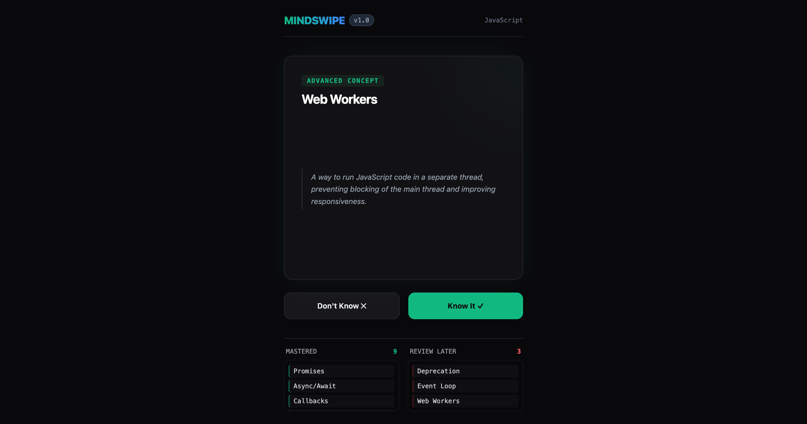

> [!IMPORTANT]
> **Compatibility Note:** This application relies on experimental browser API and currently works **only** in Google Chrome

# MindSwipe 🧠

A minimalist, high-vibe flashcard application built to test local intelligence
via the experimental Chromium built-in
[Prompt API](https://developer.chrome.com/docs/ai/prompt-api).



## Features

- **Local AI-Powered:** Runs zero-cost inference directly in your browser using
  the [Prompt API](https://developer.chrome.com/docs/ai/prompt-api).
- **Dynamic Content Streaming:** Tokens stream straight into the user interface
  in real-time.
- **Smart Context Awareness:** The local model continuously reviews your known
  and unknown concepts lists to ensure it never presents the same concept twice.

## Getting Started

1. Ensure you have an experimental Chromium browser active with the Window AI
   Prompt flags enabled.
2. Clone the repository and install dependencies:

   ```bash
   npm install
   ```

3. Boot the local server:

   ```bash
   npm run dev
   ```
